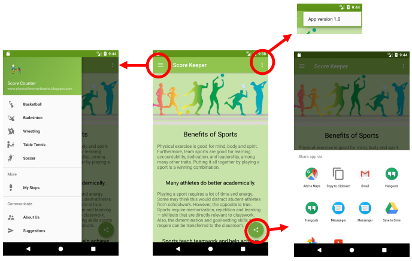
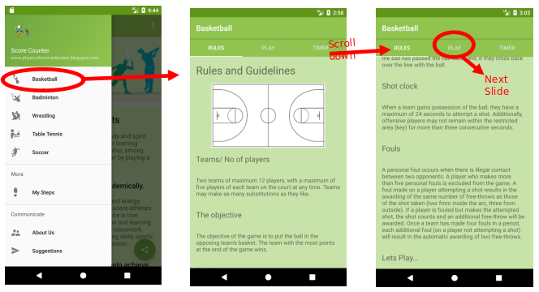
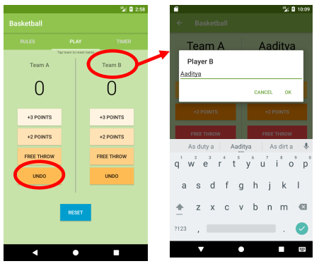
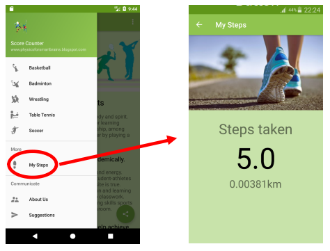

# ScoreKeeper
***

This is an basic project which helps you to keep track of the scores of a sport and it can also counts the number of steps walked by the user.
**Authors:** Aakash Yadav

### Environment setup
The following enviornemt was used to build the app
  - Android Studio 2.3.3 (for windows 10)
  - Android emulator NEXSUS 5X API 25:5554

### Features

  - Intuitive UI 
  - Timer 
  - App widget for number of steps 
  - Jelly Bean 4.3 or higher
  
### App Walkthrough 
  

